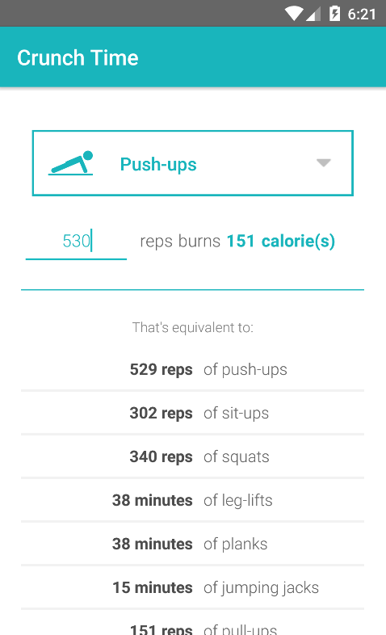

# PROG 01: Crunch Time

Crunch Time is an Android application that allows a user to select the type of exercise from a drop down menu and enter the number of reps/minutes of that exercise to calculate the amount of calories burned. The user can also see the equivalent amount of reps/minutes of all other (12 total) exercises that he or she can do in order to burn the same amount of calories. Changing the inputted number and/or changing the type of exercise will update all corresponding values accordingly. Numbers are calculated automatically after user finishes typing a number.

The app is designed for very easy use and readability. The drop down menu has simple icons representing each exercise, respectively, and the amount of calories burned is bold and stands out as well. The user can easily scan down the list of equivalent workouts to compare them.

App is viewable/usable in both portrait and landscape mode.

## Authors

Danielle Kenwood ([kenwood@berkeley.edu](mailto:kenwood@berkeley.edu))

## Demo Video

See [your demo video title here] (https://link_to_your_video)

## Screenshots

   

## Acknowledgments

* Most icons from [FlatIcon](http://www.flaticon.com/)
